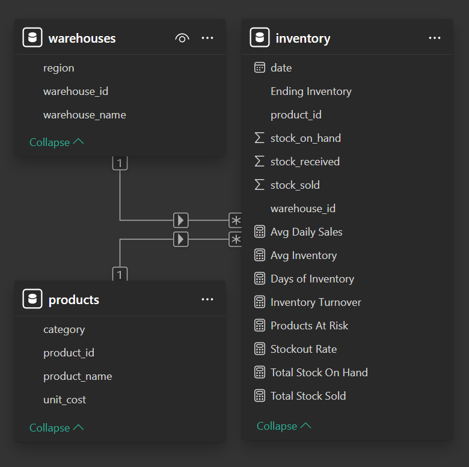

<h1 align="center">📦 Inventory Management Analytics — Power BI Project</h1>
<p align="center">
  End-to-end BI solution analyzing warehouse inventory, product movement, and operational performance.
</p>

<p align="center">
  
  
  
  
  
</p>

This project provides operational visibility into inventory levels, warehouse performance, and product demand patterns across a full year of activity. The dashboards support faster decision‑making by highlighting stock risks, turnover behavior, and regional supply chain issues.

---

## 🚀 Project Objectives

- Build an **Inventory Overview Dashboard** for executives  
- Provide **Product Deep Dive** analytics for planners  
- Deliver **Warehouse Insights** for operational teams  
- Calculate key KPIs: turnover, stockout rate, days of inventory  
- Identify **products at risk of stockout**  
- Perform **data cleaning, modeling, and DAX** end‑to‑end  

---

## ✨ Features

- **End-to-End BI Pipeline**  
  Includes data ingestion, cleaning, modeling, DAX calculations, and multi-page dashboard design.

- **Automated KPI Framework**  
  Measures inventory turnover, stockout rate, days of inventory, and product risk using dynamic DAX.

- **Star Schema Data Model**  
  Optimized relationships between products, warehouses, and daily inventory activity.

- **Power Query ETL Layer**  
  Cleanses and standardizes raw CSV files with transformations for dates, null handling, and derived fields.

- **Three Interactive Dashboard Pages**  
  Executive overview, product deep dive, and warehouse-level operational insights.

- **Business-Focused Insights**  
  Identifies supply chain bottlenecks, high-turnover categories, and regional stockout risks.

- **Instant Access**  
  Includes screenshots and a ready-to-open PBIX file—no setup required.

---

## 📂 Project Structure

The repository includes all datasets, visuals, and the full Power BI report to make the project easy to explore.

```
📦 Inventory-Management-Analytics
│
├── 📁 assets/
│   └── model.png
│
├── 📁 datasets/
│   ├── inventory.csv
│   ├── products.csv
│   └── warehouses.csv
│
├── 📁 pbix/
│   └── Inventory_Management_Report.pbix
│
├── 📁 screenshots/
│   ├── page1_inventory_overview.png
│   ├── page2_product_deep_dive.png
│   └── page3_warehouse_insights.png
│
└── README.md
```

### 📁 assets/
Contains **model.png**, the data model diagram used in both the Power BI report and this README.

### 📁 screenshots/
Contains static images of all three dashboard pages so viewers can quickly preview the report without opening Power BI.

### 📁 pbix/
Contains the full **Power BI report (.pbix)** so anyone can open the project instantly — no need to clone the repo or recreate transformations.

---

## 📁 Dataset

### **1. products.csv — Product Metadata**

| Column        | Description        |
|---------------|--------------------|
| product_id    | Primary key        |
| product_name  | Product label      |
| category      | Product category   |
| unit_cost     | Unit cost          |

---

### **2. warehouses.csv — Warehouse Attributes**

| Column         | Description              |
|----------------|--------------------------|
| warehouse_id   | Primary key              |
| warehouse_name | e.g., North Hub          |
| region         | North, East, West, South |

---

### **3. inventory.csv — Daily Activity (Jan–Dec 2024)**

| Column           | Description         |
|------------------|---------------------|
| date             | Daily record        |
| product_id       | Foreign key         |
| warehouse_id     | Foreign key         |
| stock_on_hand    | Opening balance     |
| stock_received   | Daily inbound       |
| stock_sold       | Daily outbound      |

---

## 🧹 Power Query Transformations

### **Products**
- Trimmed `product_name`  
- Normalized category capitalization  
- Converted `unit_cost` → Decimal  
- Removed duplicates  

### **Inventory**
- Ensured correct date type  
- Replaced nulls in `stock_received` & `stock_sold` → 0  
- Removed negative `stock_on_hand`  
- Added calculated column:  
  ```
  Ending Inventory = stock_on_hand + stock_received - stock_sold
  ```

### **Warehouses**
- Trimmed text fields  
- Ensured `warehouse_id` is whole number  
- Cleaned region values  

---

## 🧩 Data Model

**Star Schema**

- `products` (1) → `inventory` (*) on **product_id**  
- `warehouses` (1) → `inventory` (*) on **warehouse_id**  



---

## 📐 Key DAX Measures

```DAX
Total Stock On Hand = SUM(inventory[stock_on_hand])

Total Stock Sold = SUM(inventory[stock_sold])

Avg Daily Sales =
    AVERAGEX(
        VALUES(inventory[date]),
        [Total Stock Sold]
    )

Avg Inventory = AVERAGE(inventory[Ending Inventory])

Inventory Turnover =
    DIVIDE([Total Stock Sold], [Avg Inventory])

Days of Inventory =
    DIVIDE([Avg Inventory], [Avg Daily Sales])

Stockout Rate =
    DIVIDE(
        CALCULATE(COUNTROWS(inventory), inventory[Ending Inventory] = 0),
        COUNTROWS(inventory)
    )

Products At Risk =
    IF(
        [Total Stock On Hand] < [Avg Daily Sales] * 7,
        "At Risk",
        "OK"
    )
```

---

## 📊 Dashboard Pages

### 📌 **Page 1 — Inventory Overview**
**KPIs**
- Total Stock on Hand  
- Total Stock Sold  
- Inventory Turnover  
- Stockout Rate  
- Days of Inventory  

**Visuals**
- Area chart — Stock on hand over time  
- Bar chart — Inventory by category  
- Bar chart — Inventory by warehouse  
- Table — Product performance  

---

### 📌 **Page 2 — Product Deep Dive**
**KPIs**
- Inventory Turnover  
- Days of Inventory  

**Visuals**
- Slicer — Product selector  
- Line chart — Stock trend  
- Line chart — Sales trend  

---

### 📌 **Page 3 — Warehouse Insights**
- Column chart — Top 10 products by turnover  
- Bar chart — Stockout rate by warehouse  
- Table — “Products at Risk”  
- Pie chart — Category-level stock distribution  
- Bar chart — Inventory turnover by category  
- Line chart — Stockout rate trend  

---

## 📈 Insights & Recommendations

### **Executive Summary**  
Analysis of 2024 inventory activity across all warehouses reveals strong overall stock availability, with isolated risks driven by regional supply chain variability and product‑level demand patterns. Operational improvements can reduce stockouts, stabilize inventory levels, and improve service reliability.

## 🔍 Key Insights

### **1. Category Performance**
**Sports** products show the highest turnover, indicating strong demand and fast movement. This category requires tighter replenishment cycles to avoid future stock pressure.

### **2. Warehouse Reliability**
The **East Hub** records the highest stockout rate, signaling potential issues in inbound logistics or forecasting accuracy. This region represents the largest opportunity for operational improvement.

### **3. Product Risk Assessment**
All products currently fall under the **“OK”** threshold based on 7‑day demand coverage. However, high‑turnover items remain sensitive to short‑term supply delays and should be monitored closely.

### **4. Inventory Trend Behavior**
Inventory levels show a steady upward trend throughout the year, except for a notable dip in **February**, likely tied to supplier delays or seasonal demand spikes. This period warrants further root‑cause analysis.

---

## 🧭 Recommendations

### **1. Strengthen East Hub Replenishment**
Prioritize replenishment cycles and increase buffer stock for the East Hub to reduce stockout frequency and stabilize service levels.

### **2. Protect High‑Turnover Products**
Implement automated alerts for fast‑moving items (e.g., Sports category) to ensure proactive restocking before inventory reaches critical thresholds.

### **3. Investigate February Supply Chain Gaps**
Conduct a focused review of February’s inbound shipments and vendor performance to identify bottlenecks and prevent recurrence.

### **4. Introduce Demand‑Driven Replenishment Rules**
Adopt replenishment logic based on **turnover**, **days of inventory**, and **regional demand patterns** to improve forecasting accuracy and reduce manual intervention.

---

## 🛠 Tools Used
- Power BI  
- DAX  
- Power Query  
- Excel / CSV Files
- Star Schema Modeling  

---

## ▶️ How to Run the Project

You can explore the project in **two ways**, depending on your needs.

### **Option 1 — Quick Preview (No Setup Required)**
- Open the **screenshots** folder  
- View all three dashboard pages instantly  

### **Option 2 — Full Interactive Experience**
1. Download the `.pbix` file from the **pbix** folder  
2. Open it in **Power BI Desktop**  
3. Explore all visuals, slicers, DAX measures, and the data model  
4. No need to load data or redo transformations — everything is already built  

This setup ensures anyone can review the dashboards and underlying logic instantly.

---

<p align="center">
  — End of Project Documentation —
</p>